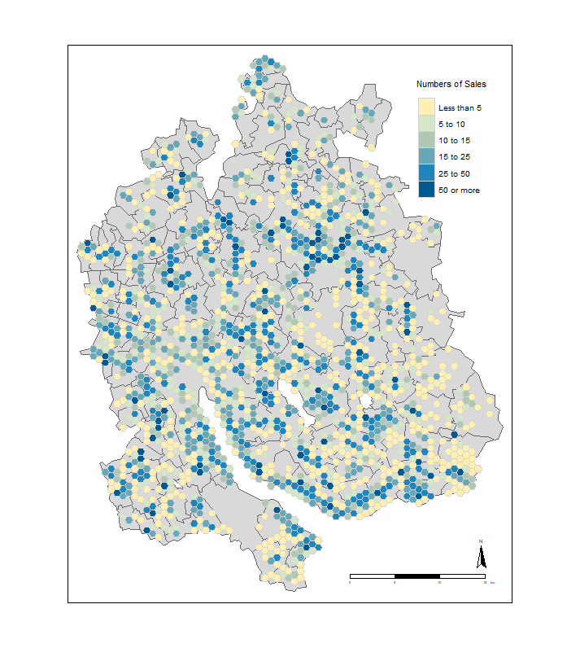

# A brief introduction to the tmap package

The tmap package is a brand new easy way to plot thematic maps in R. Thematic maps are geographical maps in which spatial data distributions are visualized. This package offers a flexible, layer-based, and easy to use approach to create thematic maps, such as choropleths and bubble maps. The syntax for creating plots is similar to that of `ggplot2`. 

## Two useful websites

- THE website to start with: https://cran.r-project.org/web/packages/tmap/vignettes/tmap-nutshell.html
- A really nice presentation that shows all the basics and much more: http://rstudio-pubs-static.s3.amazonaws.com/229482_b5b182f650434a36ace4eeef2d2bcd83.html#1


## A first example with tmap

```{r packages ,message= F}
library(pacman)
pacman::p_load(tmap, statR, tidyverse, sp, cartogram)
data(metro, World)
```

Let's start with a simple first example included in the package. All we need ist the package tmap and the spatial data "World", which is a SpatialPolygonsDataFrame and "metro", which is a SpatialPointsDataFrame.

```{r load data}
class(metro)
class(World)
```

The "World"-DataFrame includes informations on the population, the economy and so on of all countries in the world. 
```{r World Data}
World %>% as.data.frame() %>% head()

```

It is a SpatialPolygonsDataFrame, so we can simply draw a map that contains this information. For instance "The countries of the world by happiness index"

```{r first worldMap}
tm_shape(World)+tm_polygons("HPI", palette="-Blues", contrast=.7, id="name", title="Happiness Index")
```


If we want to add more information to this map, we can do this simply by drawing more layers over this base map. 

Let's have a look into the metro-DataFrame. It shows the population of the metropolitan regions in the world, for example all metropolitan regions of Switzerland, i.e. Zurich.
```{r metro Zurich data}
metro %>% as.data.frame() %>% dplyr::filter(iso_a3=="CHE") %>% head()

```

```{r metro Zurich map}
tm_shape(subset(metro,metro$iso_a3=="CHE"))+tm_bubbles("pop2010")
```

OK, that's not very meaningful. So let's look at the whole world.

```{r}
tm_shape(metro)+tm_bubbles("pop2010")
```

A much better picture can be obtained if the information on the population is presented in a somewhat better graphic form and supplemented by a growth rate of the population figures. So, let's add some color and a nicer looking legend.

```{r}
metro$growth <- (metro$pop2020 - metro$pop2010) / (metro$pop2010 * 10) * 100

    tm_shape(metro) +
    tm_bubbles("pop2010", col = "growth", 
 breaks=c(-Inf, seq(0, 6, by=2), Inf),
               palette="-RdYlBu", contrast=1, 
               title.size="Metro population", 
               title.col="Growth rate (%)", id="name") + 
    tm_format_World_wide()
```

Now we can simply put the two maps (the happiness index world map an the population growth bubbles) on top of each other and get a simple yet informative map.

```{r}
data(World, metro)
metro$growth <- (metro$pop2020 - metro$pop2010) / (metro$pop2010 * 10) * 100

mapWorld <- tm_shape(World) +
    tm_polygons("income_grp", palette="-Blues", contrast=.7, id="name", title="Income group") +
    tm_shape(metro) +
    tm_bubbles("pop2010", col = "growth", 
               border.col = "black", border.alpha = .5, 
               style="fixed", breaks=c(-Inf, seq(0, 6, by=2), Inf),
               palette="-RdYlBu", contrast=1, 
               title.size="Metro population", 
               title.col="Growth rate (%)", id="name") + 
    tm_style_gray() + tm_format_World_wide()

mapWorld
```

So this is our first static map. You can't see details, but you can already see a lot of things from an overview point of view. But if you want to look at details of individual regions or metropolises, you need something more, namely an interactive version, which allows you to zoom into your point of interest. 

This is very easy with the tmap package. The only thing to do is to change from the `plot` mode to the `view` mode. Afterwards we easyly plot the existing map a second time. Nad abracadabra you have an interactive leaflet map, where you can zoom in and some additional informations in a tooltip.

```{r}
# set mode to view:
tmap_mode("view")
```

```{r interactive world map, message=FALSE}
mapWorld
```


## An example for Zurich (Numbers of sold houses between 2007 und 2017)

This example includes all sales of detached houses since 2007. Because the data cannot be published for data protection reasons, I focus on the number of sold houses and artificial prices. Here is a first view on the desired result:




The aim of the map is to provide a simple overview of prices in the canton. Up to now, the amount of sold houses has been presented at regional level and, if necessary, at municipal level. However, a more differentiated overview is obtained when the data is aggregated into grids or hexbins.


```{r include=F}
load(file = "hexbin_orig.RData")
load(file = "hex_geb_fake.RData")
load(file = "ZHshape.RData")
tmap_mode("plot")

hex_geb_data <- hex_geb_fake %>% 
  mutate(bfs_akt=ifelse(bfs_akt==133, 295,
                        ifelse(bfs_akt==217, 294, bfs_akt))) %>% 
  group_by(bfs_akt) %>% 
  summarise(anz=n(),
            med_preis=median(n_preis/500))

ZHshape2 <- ZHshape

ZHshape2@data <- ZHshape2@data %>% mutate(BFS=as.numeric(as.character(BFS)))
ZHshape2@data <- left_join(ZHshape2@data, hex_geb_data, by = c("BFS" = "bfs_akt"))
ZHshape2@data <- ZHshape2@data %>% as.data.frame()
```


Let's start the new simple way

```{r loading the packages,message= F}
pacman::p_load(rgeos, rgdal, ggmap, leaflet)
```

```{r loading the data}
tmap_mode("plot")

```

A first glance at the data set
```{r}
class(hexbin_orig)
class(hex_geb_fake)
```

```{r}
head(hex_geb_fake)
```

### A simple map

And now let's produce our map. 

```{r Produktion Karte, include= F}
## Handänderungstyp
typp <-"EFH"

# gefilterter Datensatz für Karte (Hexagone)
hex_geb_agg<- hex_geb_fake %>% 
 dplyr::filter(typ==typp) %>%                                        
  group_by(id_grid) %>%
  summarise(anz = n(),
            med_preis = median(n_preis/500)) %>%
  arrange(med_preis) %>%
  ungroup() 

## Now you want to join it back to the grid data for mapping
# we are joining it straight to the missGrid spatial data frame
hexbin_zh <- hexbin_orig
hexbin_zh@data <- left_join(hexbin_zh@data, hex_geb_agg, by = c("id_grid" = "id_grid"))
hexbin_zh <- subset(hexbin_zh, hexbin_zh@data$anz>0)

# Some parameters for the map

value <- "anz"
if (value=="anz"){
anzeige <- "Numbers of Sales"
brekks = c(-Inf, 5, 10, 15, 25, 50, +Inf)
} else if (value == "med_preis") {
anzeige <- "Artificial price in\n 1'000 CHF (Median)"
brekks = c(-Inf, 500, 750, 1000, 1500, 2000, 2500, +Inf)
}

```


```{r}

mapZH <- tm_shape(hexbin_zh) +
    tm_polygons(value, breaks=brekks, palette=rev(zhpal$zhlake),  colorNA =NULL, contrast=.8, title=anzeige,  border.col = "lightgrey")

mapZH

```

OK, now we have a map with an entry for every area where a detached house has been sold. However, it is not yet clear in which region of the world we are operating. For this you need a background map. Here we have different maps as shape-files available. So let's take a map with the current municipal boundaries.

```{r}
load(file = "ZHshape.RData")

#ZHshape <- rgdal::readOGR('L:/STAT/08_DS/03_GIS/Geodaten/Administrative_Grenzen/Gemeinden/Politische_Gemeinden_ZH/Shapes_Stände/Shape_generalisiert_2018/GEN_A4_GEMEINDEN_2018_F.shp')
```

And this is what this cantonal map now looks like:

```{r}

qtm(ZHshape, fill="#b7c6e5")

```

We see a great little feature of tmap, the Quick Thematic Map (qtm), which simply plots a map. We can now add more layers to this simple command as we did with ggplot2. 

```{r}
qtm(ZHshape) + tm_compass() + tm_style_classic()+ tm_scale_bar()
```

Now let's add the information we created earlier, so that we know in which areas in the canton of Zurich how many houses were sold. To make everything look good, I'll change the legend a little bit and introduce you to the classic version of the tmap.

```{r}

qtm(ZHshape, fill= "#b7c6e5")  +tm_compass() + tm_scale_bar()+
  tm_layout(scale = .5,
            legend.position = c(.78,.72), 
            legend.outside.size = 0.1,
            legend.title.size = 1.6,
            legend.height = 0.9,
            legend.text.size = 1.2, 
            legend.hist.size = 0.6)+
  mapZH

```

### Interactive map with leaflet and tmap

So far so good. Another strength of tmap is the direct integration of the leaflet. We saw that earlier. Let's try that for the cantonal map, too. To be able to display the informative tooltips here as well, I have to extend the function with which we produced the map earlier.

```{r}

mapZH <- tm_shape(hexbin_zh) +
    tm_polygons(value, breaks=brekks, palette=rev(zhpal$zhlake), colorNA =NULL, contrast=.8, id="GEMEINDENA", title=anzeige, border.col = "lightgrey", border.alpha = NA, popup.vars=c("Numbers of Sales"="anz", "Price in CHF (Median)"="med_preis",  "ID"="GRID_ID"))
```

```{r}
tmap_EFH <- tmap_leaflet(mapZH, mode = "view", show = FALSE) %>% setView(1249033,2682288,zoom=11)%>% fitBounds(-72, 40, -70, 43)%>% clearBounds() 
p_load(htmlwidgets)
#saveWidget(tmap_EFH, file="tmap_EFH_anz.html")
tmap_EFH

```


### The cartogram function

And finally another great feature of the tmap package: The cartogram function. Many of you probably know these maps with color-filled polygons. At least I have used them more often in my last publications.

```{r traditional map}
qtm(ZHshape2, fill="med_preis")
```

As you can see, this is also very easy to produce with the qtm function.

With the additional "cartogram" package you can add another dimension of information to this simple informative map. Here you see a map, whose coloring represents the price and where the size of the polygons additionally represents the number of sold objects. Especially in Winterthri many EInfamilienhäuser were sold, relative to the size of the municipality Winterthur.


```{r cartogram, message=F}

library(cartogram)
ZHcarto<- cartogram(ZHshape2, "anz", itermax=5)
tm_shape(ZHcarto) + tm_fill("med_preis", style="jenks") + 
  tm_borders() + tm_layout(frame=F)
```

<!-- # Apendix: The data-manipulation -->

<!-- Obtaining and processing house data. This code is for documentation purposes only. It cannot be executed unless the rights and access to the database are guaranteed. -->

<!-- ```{r} -->
<!--  source("P:/db_connect.r") -->
<!-- ``` -->


<!-- ```{sql connection=statop, output.var = "ha_geb"} -->
<!--  select S_ID,    S_J_ERHJAHR,    BFS_AKT,  BFS_ORIG  parznr, N_PREIS, CENTROID_X, CENTROID_Y from HA_PROD.HA_HAUPTTAB_AS_MV a -->
<!--  join ( select BFSNR, gemeindefus_neu, COALESCE(gemeindefus_neu, BFSNR) AS BFS_neu, NUMMER, SHAPE_AREA, CENTROID_X, CENTROID_Y  from GEO.LIEGEN_GESAMT_TEMP_MV -->
<!--      left join (select * from gemeindefus) -->
<!--      on bfsnr = gemeindefus_alt) d -->
<!--  on a.BFS_AKT = d.BFS_neu AND a.parznr=d.nummer -->
<!--  where  c_artlieg = 7                           --(Wohngebäude)) -->
<!--      and C_EFH = 1 -->
<!--      and c_arthandae = 1                           --(Nur Kaufgeschäfte) -->
<!--      and S_J_ERHJAHR between 2007 and 2017      --(Einschränkung des Kaufjahres) -->
<!-- ``` -->


<!-- ```{sql connection=statop, output.var = "ha_geb"} -->
<!-- select  -->
<!--     S_ID, S_J_ERHJAHR, BFS_AKT, BFS_orig, c_artlieg, C_EFH, c_arthandae,N_PREIS, -->
<!--     BFSNR, gemeindefus_neu, COALESCE(gemeindefus_neu, BFSNR) AS BFS_neu, parznr, SHAPE_AREA, CENTROID_X, CENTROID_Y  -->
<!-- from  -->
<!--     (  -->
<!--     select  -->
<!--         S_ID,    S_J_ERHJAHR,    BFS_AKT, BFS_orig, c_artlieg,  C_EFH, c_arthandae,  -->
<!--         case  -->
<!--             when bfs_orig=217 then 'EL'||parznr -->
<!--             when bfs_orig=222 then 'HS'||parznr -->
<!--             when bfs_orig=132 then 'HL'||parznr -->
<!--             when bfs_orig=133 then 'HN'||parznr -->
<!--             when bfs_orig=174 then 'IE'||parznr -->
<!--             when bfs_orig=175 then 'KY'||parznr -->
<!--             when bfs_orig=171 then 'BA'||parznr -->
<!--             when bfs_orig=179 then 'ST'||parznr -->
<!--             when bfs_orig=212 then 'BE'||parznr -->
<!--             when bfs_orig=229 then 'WD'||parznr -->
<!--         else parznr end as parznr,  -->
<!--         N_PREIS from HA_PROD.HA_HAUPTTAB_AS_MV -->
<!--     ) a -->
<!-- join  -->
<!--     ( -->
<!--     select  -->
<!--     BFSNR, gemeindefus_neu, COALESCE(gemeindefus_neu, BFSNR) AS BFS_neu, nummer, SHAPE_AREA, CENTROID_X, CENTROID_Y  -->
<!--     from -->
<!--         ( select BFSNR,     -->
<!--         case  -->
<!--         when BFSNR=217 then 'EL'||NUMMER -->
<!--         when BFSNR=222 then 'HS'||NUMMER -->
<!--         when BFSNR=132 then 'HL'||NUMMER -->
<!--         when BFSNR=133 then 'HN'||NUMMER -->
<!--         when BFSNR=174 then 'IE'||NUMMER -->
<!--         when BFSNR=175 then 'KY'||NUMMER -->
<!--         when BFSNR=171 then 'BA'||NUMMER -->
<!--         when BFSNR=179 then 'ST'||NUMMER -->
<!--         when BFSNR=212 then 'BE'||NUMMER -->
<!--         when BFSNR=229 then 'WD'||NUMMER -->
<!--         else NUMMER end as NUMMER, SHAPE_AREA, CENTROID_X, CENTROID_Y  from GEO.LIEGEN_GESAMT_TEMP_MV -->
<!--         ) b1 -->
<!--     left join  -->
<!--         ( -->
<!--         select * from gemeindefus -->
<!--         ) b2 -->
<!--     on b1.bfsnr = b2.gemeindefus_alt -->
<!--     ) b -->
<!-- on a.BFS_AKT = b.BFS_neu  -->
<!-- AND a.parznr=b.nummer   -->
<!-- where  a.c_artlieg = 7                           --(Wohngebäude)) -->
<!-- and a.C_EFH = 1 -->
<!-- and a.c_arthandae = 1                           --(Nur Kaufgeschäfte) -->
<!-- and a.S_J_ERHJAHR between 2007 and 2010     --(Einschränkung des Kaufjahres) -->
<!-- ``` -->

<!-- ```{sql connection=statop, output.var = "t_gemeinde"} -->
<!--  select gde_bfsnr, gde_name,raumplanreg_name,  bezirk_name from GEMEINDE -->
<!--  where aktiv=1 -->
<!-- ``` -->


<!-- ```{r Datensatz aufbereiten} -->
<!--  source("L:/STAT/03_AS/01_Werkzeuge/01_Toolbox/R/Funktionen/my_sum.r") -->

<!--  names(t_gemeinde)<-tolower(names(t_gemeinde)) -->
<!--  names(ha_geb)<- tolower(names(ha_geb)) -->

<!--  ha_df <- ha_geb %>% -->
<!--    mutate(typ="EFH") -->

<!--  my_sum(ha_df, n_preis, s_j_erhjahr) -->
<!-- ``` -->

<!-- ```{r Vorbereitung Maps} -->
<!--  ZHshape <- rgdal::readOGR('L:/STAT/08_DS/03_GIS/Geodaten/Administrative_Grenzen/Gemeinden/Politische_Gemeinden_ZH/Shapes_Stände/Shape_generalisiert_2018/GEN_A4_GEMEINDEN_2018_F.shp') -->

<!--  swissgridneu<-CRS("+init=epsg:2056") -->

<!--  hexbin_orig <- rgdal::readOGR("L:/STAT/08_DS/03_GIS/Geodaten/Raster/Hexbin/Hexbin_0.5sqkm/Hexbin_05sqkm.shp") -->
<!--  proj4string(hexbin_orig) <- swissgridneu -->
<!--  hexbin_orig@data <- mutate(hexbin_orig@data, id_grid = as.numeric(rownames(hexbin_orig@data))) -->
<!--  hexbin_orig@data <- mutate(hexbin_orig@data, BFS=ifelse(as.numeric(as.character(BFS))==133, 295, -->
<!--                                                          ifelse(as.numeric(as.character(BFS))==217, 294, as.numeric(as.character(BFS))))) -->

<!--  ha_geb<- ha_df %>% -->
<!--    dplyr::filter(centroid_x>0 &  (typ=="EFH" & n_preis<5000000) ) -->

<!--  coordinates(ha_geb)<-ha_geb[,c("centroid_x", "centroid_y")] -->
<!--  proj4string(ha_geb)<-swissgridneu -->

<!--  # Set a unique identifier for both of the data frames -->
<!--  #hexbin_orig@data <- mutate(hexbin_orig@data, id_grid = as.numeric(rownames(hexbin_orig@data))) -->
<!--  ha_geb@data <- mutate(ha_geb@data, id_ha_geb = as.numeric(rownames(ha_geb@data))) -->

<!-- # The houses get the value of the grid they are on top of -->
<!-- hex_geb <- over(ha_geb, hexbin_orig) -->

<!-- # the order didn't change so re add id_bus to the new table -->
<!-- hex_geb <- mutate(hex_geb, id_ha_geb = as.numeric(rownames(hex_geb))) -->

<!-- #Now join each original business to its grid location -->
<!-- hex_geb <- left_join(ha_geb@data, hex_geb, by = c("id_ha_geb" = "id_ha_geb")) -->

<!-- ha_data <- hex_geb %>% dplyr::select(-id_grid, -GRID_ID) -->

<!-- random=runif(length(hex_geb$id_grid),0,1) %>% as.data.frame() %>% dplyr::rename(random=".") -->

<!-- hex_geb_fake <- hex_geb %>%  bind_cols(random) %>%mutate(n_preis=n_preis*random) %>% dplyr::select(-random, -parznr, -id_ha_geb) -->

<!-- save(hex_geb_fake, file = "hex_geb_fake.RData") -->
<!-- save(hexbin_orig, file = "hexbin_orig.RData") -->
<!-- save(ZHshape, file = "ZHshape.RData") -->
<!-- ``` -->
